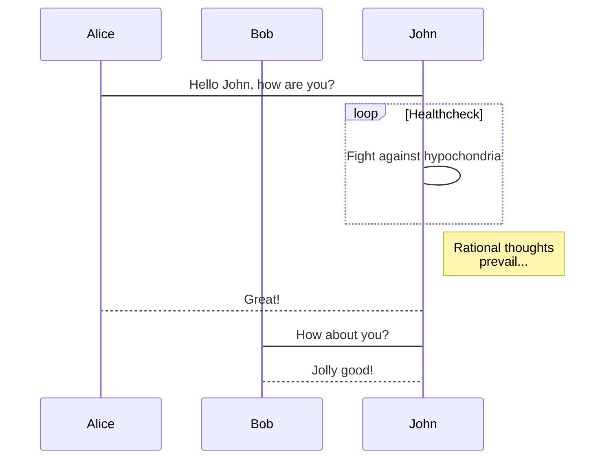
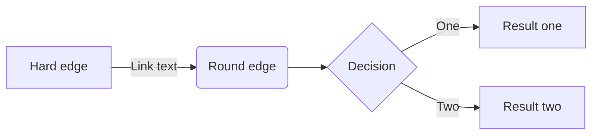
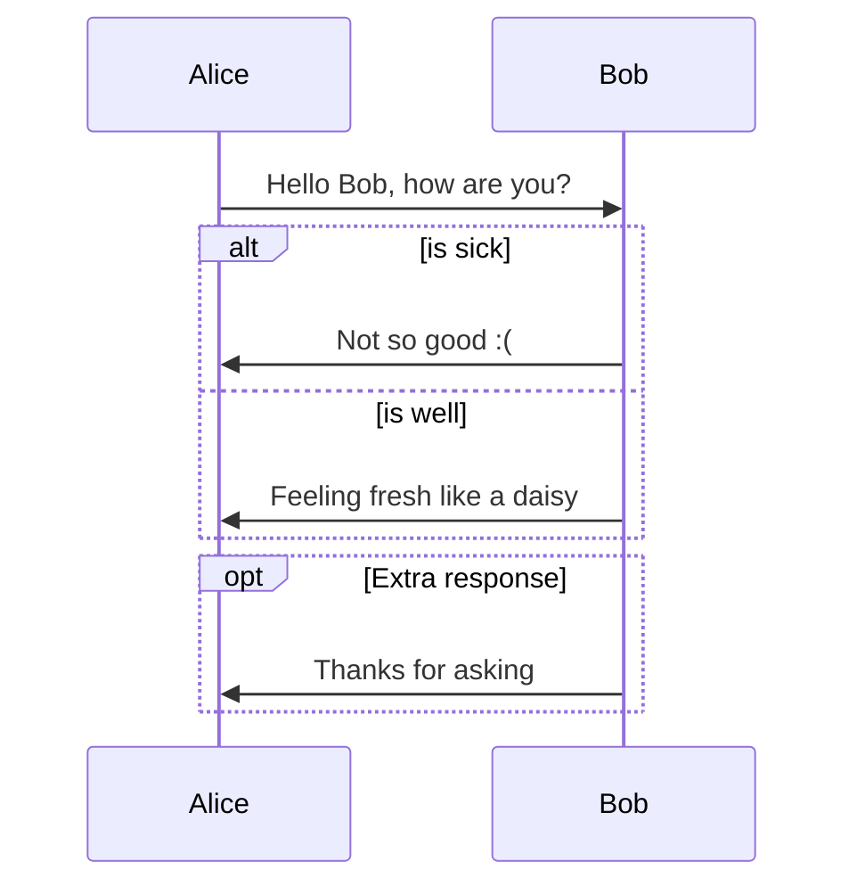
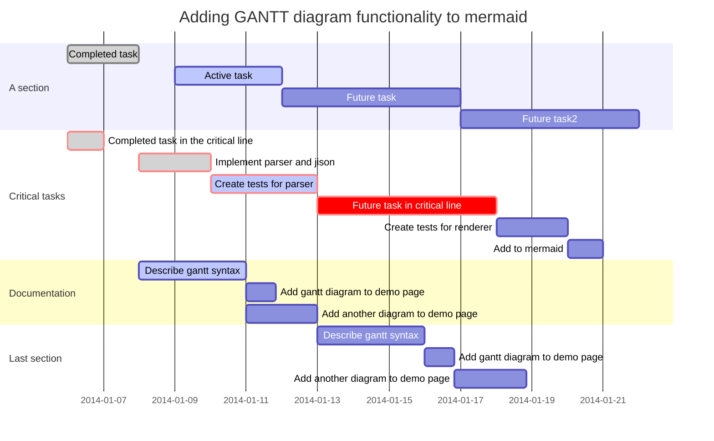

# Mermaid


建议将源码文件复制到编辑器查看学习！
It is recommended to copy the source code file to the editor to view the study!

[源码文件 Raw File](https://raw.githubusercontent.com/JaxsonWang/WP-Editor.md/docs/Example/Mermaid.md)

---




```mermaid
gantt
        dateFormat  YYYY-MM-DD
        title Adding GANTT diagram functionality to mermaid
        section A section
        Completed task            :done,    des1, 2014-01-06,2014-01-08
        Active task               :active,  des2, 2014-01-09, 3d
        Future task               :         des3, after des2, 5d
        Future task2               :         des4, after des3, 5d
        section Critical tasks
        Completed task in the critical line :crit, done, 2014-01-06,24h
        Implement parser and jison          :crit, done, after des1, 2d
        Create tests for parser             :crit, active, 3d
        Future task in critical line        :crit, 5d
        Create tests for renderer           :2d
        Add to mermaid     
```





