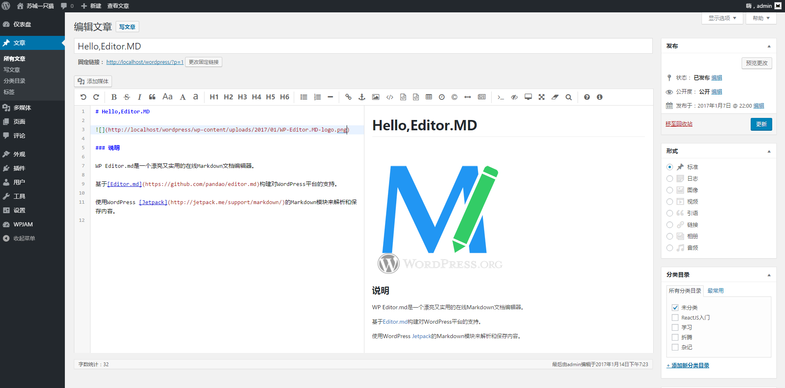

# WP Editor.MD

### 说明 Description

WP Editor.MD是一个漂亮又实用的在线Markdown文档编辑器。

WP Editor.MD is a beautiful and practical Markdown document editor.

基于[Editor.md](https://github.com/pandao/editor.md)构建对WordPress平台的支持。

Build support for the WordPress on [Editor.md](https://github.com/pandao/editor.md).

使用WordPress [Jetpack](http://jetpack.me/support/markdown/)的Markdown模块来解析和保存内容。

Use the Markdown module of WordPress [Jetpack](http://jetpack.me/support/markdown/) to parse and save content.

### 特征 Feature

 - [x] 支持实时预览、代码插入、代码折叠等功能；
 - [x] 支持 [Emoji 表情](http://www.emoji-cheat-sheet.com/)
 - [ ] 支持 TeX 科学公式（基于 [KaTeX](http://khan.github.io/KaTeX/)）、流程图 [Flowchart](https://pandao.github.io/editor.md/examples/flowchart.html) 和 时序图 [Sequence Diagram](https://pandao.github.io/editor.md/examples/sequence-diagram.html)

---

 - [x] Real-time Preview, Preformatted text/Code blocks/Tables insert, Search replace, Code syntax highlighting;
 - [x] Support [Emoji](http://www.emoji-cheat-sheet.com/)
 - [ ] Supports TeX scientific formulas (based on [KaTeX](http://khan.github.io/KaTeX/), [Flowchart](https://pandao.github.io/editor.md/examples/flowchart.html ) And the [Sequence Diagram](https://pandao.github.io/editor.md/examples/sequence-diagram.html)
 
### 安装 Installation

1. 上传 `WP-Editor.MD`目录 到 `/wp-content/plugins/` 目录;

1. 在后台插件菜单激活该插件;

---

- Upload the `WP-Editor.MD` directory to the `/wp-content/plugins/` directory;

- Enable the WordPress Plugins

### 截图 Screenshots

## 更新日志 Changelog

> Version 1.3

* 支持WP多媒体文件插入;Support WP Media module;
* 一些样式错位修复;Some style dislocation repair;

> Version 1.2

* 修复编辑器无法全屏的问题;Fix the editor can not be full screen;

> Version 1.1

* 重写框架，优化规范代码; Rewrite Rahmenverordnung Code-Optimierung;
* 支持Emoji表情; Support Emoji expression;

> Version 1.0

* 第一版本 Initial version

### 其他 Other

本人博客：[苏城一只猫](https://iiong.com)

My Blog: [Jaxson'Blog](https://iiong.com)

插件发布：[WP Editor.MD：一个好用的Markdown WP插件](https://iiong.com/wordpress-plugins-wp-editormd.html)

捐赠(Donation)：

Left=AliPay

Right=WeChat

感谢您的捐赠！Thank you for your donation!

